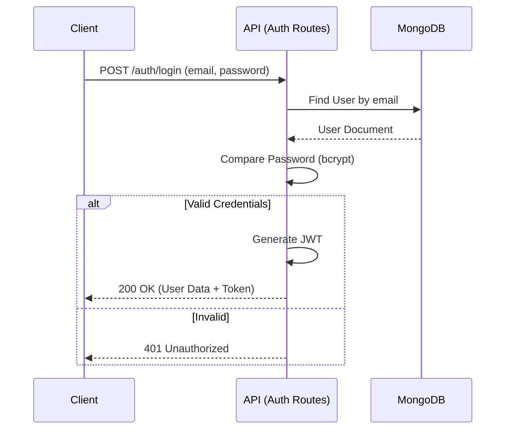

# Backend Structure and Data Flow Report

This report provides a comprehensive analysis of the `/backend` directory structure, outlining the architecture, data flow, API endpoints, and database interactions of the Game Journal V2 application.

## 1. High-Level Architecture

The backend is built using the **MERN** stack (Mongo, Express, React, Node), utilizing **TypeScript** for type safety. It follows a layered architecture pattern:

1.  **Entry Point**: Server initialization and database connection.
2.  **App Config**: Middleware setup (security, parsing, logging).
3.  **Routes**: API endpoint definitions.
4.  **Controllers**: Request handling and business logic.
5.  **Models**: Mongoose schemas and database interactions.

### Architecture Diagram

```mermaid
graph TD
    Client[Client Request] --> Server[Server Entry (server.ts)]
    Server --> App[App Config (app.ts)]
    App --> Middleware[Middleware Layer]
    Middleware --> Routes[Router Layer]
    Routes --> AuthR[Auth Routes]
    Routes --> UserR[User Routes]
    Routes --> EntriesR[Journal Entry Routes]
    
    AuthR --> AuthC[Auth Controller]
    UserR --> UserC[User Controller]
    EntriesR --> EntriesC[Journal Entries Controller]
    
    AuthC --> UserM[User Model]
    UserC --> UserM
    EntriesC --> EntryM[JournalEntry Model]
    
    UserM --> DB[(MongoDB)]
    EntryM --> DB
```

## 2. Directory Structure Overview

The `/backend/src` directory is organized as follows:

*   **`configs/`**: Configuration files (CORS, Rate Limiting).
*   **`controllers/`**: Functions that handle specific API requests.
*   **`errors/`**: Custom error classes (NotFound, Unauthorized, etc.).
*   **`middlewares/`**: Express middleware (Auth, Error Handling, Validation).
*   **`models/`**: Mongoose data models (`User`, `JournalEntry`).
*   **`routes/`**: Route definitions mapping URLs to controllers.
*   **`utils/`**: Helper functions (Hashing, JWT, DB Connect).
*   **`zodSchemas/`**: Zod schemas for request validation.
*   **`app.ts`**: Express application setup.
*   **`server.ts`**: Server entry point.

## 3. Data Flow & Logic

### 3.1 Authentication Flow

Authentication is handled via **JWT (JSON Web Tokens)**.

*   **Registration/Login**: User credentials are validated. On success, a JWT is generated containing the `userId`.
*   **Protection**: Protected routes use the `authenticate` middleware to verify the JWT from the `Authorization` header.



### 3.2 Request Lifecycle

1.  **Incoming Request**: Hits `server.ts` -> `app.ts`.
2.  **Global Middleware**:
    *   `rateLimit`: Limits repeated requests.
    *   `cors`: Handles Cross-Origin Resource Sharing.
    *   `helmet`: Sets security headers.
    *   `express.json`: Parses JSON bodies.
    *   `morgan`: Logs HTTP requests.
3.  **Router**: Dispatches to specific route handlers (e.g., `/api/v1/entries`).
4.  **Route Middleware**:
    *   `authenticate`: Verifies JWT for protected routes.
    *   `zodValidate`: Validates request body against Zod schemas.
    *   `validateObjectId`: Ensures ID params are valid Mongo ObjectIDs.
5.  **Controller**: Executes business logic, interacts with Models.
6.  **Response**: JSON response sent back to client.
7.  **Error Handling**: Centralized `errorHandler` middleware catches exceptions.

## 4. API Endpoints

### Auth (`/api/v1/auth`)

| Method | Endpoint | Description | Protected | Input |
| :--- | :--- | :--- | :--- | :--- |
| `POST` | `/register` | Register a new user | No | `email`, `password` |
| `POST` | `/login` | Login user | No | `email`, `password` |
| `POST` | `/logout` | Logout user | No | |

**Detailed Logic:**
*   **Register**: Validates input via Zod. Checks for existing email (defined in Schema). Hashes password via pre-save hook. Generates a JWT immediately so the user is logged in upon registration.
*   **Login**: explicitly selects the password field (hidden by default). Uses `bcrypt.compare` to validate credentials. Returns a JWT.
*   **Logout**: Stateless; sends a success message. Client is responsible for discarding the token.

### User (`/api/v1/user`)

| Method | Endpoint | Description | Protected | Input |
| :--- | :--- | :--- | :--- | :--- |
| `GET` | `/` | Get current user info (`whoAmI`) | **Yes** | |
| `PATCH` | `/` | Update user profile | **Yes** | `email`, `password` |
| `DELETE` | `/` | Delete user and all entries | **Yes** | |

**Detailed Logic:**
*   **WhoAmI**: Uses the `userId` extracted from the JWT (via `authenticate` middleware) to fetch the user profile, excluding the password.
*   **Patch**: Strictly filters `req.body` to allow only `email` and `password` updates. If password is changed, it triggers the pre-save hash hook.
*   **Delete**: Performs a **cascading delete**. It first removes all `JournalEntry` documents associated with the user, then deletes the `User` document itself, ensuring no orphaned data remains.

### Journal Entries (`/api/v1/entries`)

| Method | Endpoint | Description | Protected | Input |
| :--- | :--- | :--- | :--- | :--- |
| `GET` | `/` | Get all entries (Paginated, Filtered) | **Yes** | Query Params: `limit`, `cursor`, `status`, `platform`, `title`, `rating`, `dates` |
| `POST` | `/` | Create new entry | **Yes** | `title`, `platform`, `status`, `rating`, `entryDate`, `notes` |
| `GET` | `/statistics` | Get entry statistics | **Yes** | |
| `GET` | `/:id` | Get specific entry | **Yes** | |
| `PATCH` | `/:id` | Update entry | **Yes** | Partial entry fields |
| `DELETE` | `/:id` | Delete entry | **Yes** | |

**Detailed Logic:**
*   **Get All (List)**:
    *   **Filtering**: Supports partial text search for `title` (Regex), exact match for `status`/`platform`/`rating`, and date ranges (`startDate`, `endDate`) for `entryDate`.
    *   **Pagination**: Uses **Cursor-based pagination** (using `entryDate`) instead of offset-based, which is more performant for infinite scrolls.
    *   **Sorting**: Enforced to chronological (`entryDate`: desc).
*   **Statistics**:
    *   Uses a **MongoDB Aggregation Pipeline**.
    *   **Lifetime Stats**: Groups by `status` to count total games per state.
    *   **Yearly Stats**: Extracts the year from `createdAt` and groups by `year + status` to show trends over time.
    *   Data is transformed in the controller from an array of objects to a mapped dictionary for easier frontend consumption.
*   **Patch**:
    *   Includes validation logic to ensure data consistency: If `status` is set to 'completed', a `rating` is mandatory. Conversely, `rating` is only allowed if the status is 'completed'.
*   **Delete**: Simple ID-based deletion scoped to the current user.

## 5. Data Models

### User Model (`User.ts`)
*   **Fields**:
    *   `email`: String (Unique, Indexed, Validated)
    *   `password`: String (Hashed, Select: false)
    *   `verified`: Boolean
*   **Methods**:
    *   `createJWT()`: Generates auth token.
    *   `comparePassword()`: Validates password.

### Journal Entry Model (`JournalEntry.ts`)
*   **Fields**:
    *   `createdBy`: ObjectId (Ref: User)
    *   `title`: String (Required)
    *   `platform`: String (Required)
    *   `status`: Enum ('started', 'completed', 'dropped', 'revisited', 'paused')
    *   `entryDate`: Date
    *   `rating`: Number (0-10)
    *   `notes`: String (Max 1000 chars)
*   **Indexes**:
    *   `{ createdBy: 1 }`: For fetching user's entries.
    *   `{ createdBy: 1, createdAt: 1, status: 1 }`: For statistics.

## 6. Key Libraries & Tools

*   **Express**: Web framework.
*   **Mongoose**: MongoDB object modeling.
*   **Zod**: Schema validation for request bodies.
*   **Bcryptjs**: Password hashing.
*   **Jsonwebtoken**: Authentication tokens.
*   **Helmet/Cors/XSS-Sanitizer**: Security.

## 7. Structural Assessment

### Strengths
1.  **Safety & Validation**: The combination of **TypeScript** and **Zod** provides excellent end-to-end type safety. Zod schemas validate inputs before they reach the controller, reducing boilerplate checks.
2.  **Security Best Practices**: The project implements essential security layers:
    *   `helmet` for headers.
    *   `express-xss-sanitizer` for input sanitization.
    *   `rate-limit` to prevent abuse.
    *   `bcrypt` for proper password hashing.
3.  **Modular Architecture**: The directory structure is clean. Routes, controllers, and models are well-separated. Middleware is reusable.
4.  **Performance**:
    *   Cursor-based pagination is a scalable choice for lists.
    *   Database indexing is correctly applied to frequent query fields (`createdBy`, `status`, `createdAt` / `entryDate`).

### Areas for Improvement
1.  **Service Layer**: Currently, business logic resides in **Controllers** (e.g., the statistics aggregation and complex filtering).
    *   *Recommendation*: Extract complex logic into a `services/` layer (e.g., `JournalService.ts`). This would make unit testing easier and keep controllers "skinny".
2.  **Query Building**: The filtering logic in `getJournalEntries` is constructed manually with multiple `if` statements.
    *   *Recommendation*: As filters grow, this can become messy. Adopting a query builder utility or pattern would improve maintainability.
3.  **Error Handling**: While there is a global handler, some errors might be generic.
    *   *Recommendation*: Ensure all Zod errors and MongoDB validation errors are mapped to user-friendly messages with specific error codes.

